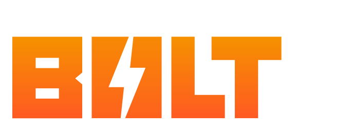

# TAS-AdobeEdition

  

  

---

> **TAS-AdobeEdition** is the bridge that connects the creative power of Adobe with the automation magic of TheAnimeScripter CLI.

---

## 🌉 What is this?

This repository acts as a seamless bridge between the [TheAnimeScripter](https://github.com/NevermindNilas/TheAnimeScripter) backend CLI and Adobe applications. It enables direct communication, automation, and integration—so you can supercharge your Adobe workflow with the full power of TAS.

- **Not the main codebase:** For core features, issues, and updates, visit the [main repo](https://github.com/NevermindNilas/TheAnimeScripter).
- **Purpose:** This repo is all about connecting worlds—making sure your creative tools and automation scripts work together in harmony.

## 🗺️ How does it fit in?

1. **TheAnimeScripter CLI**: The engine that does the heavy lifting.
2. **TAS-AdobeEdition (this repo)**: The bridge that links the CLI to Adobe apps.
3. **Adobe Applications**: Where your creative magic happens.

## 🚀 Get Started

For most users, start with the [main repository](https://github.com/NevermindNilas/TheAnimeScripter) for setup instructions, documentation, and support.

---

  <em>Build. Bridge. Create.</em>

